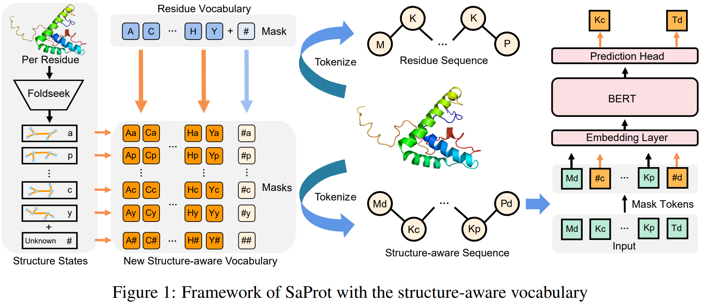
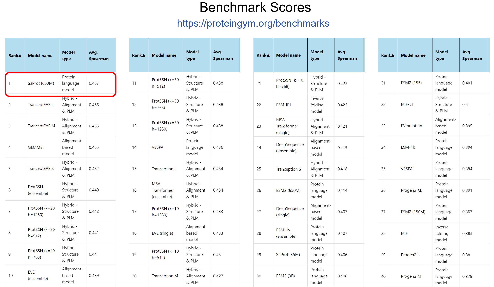
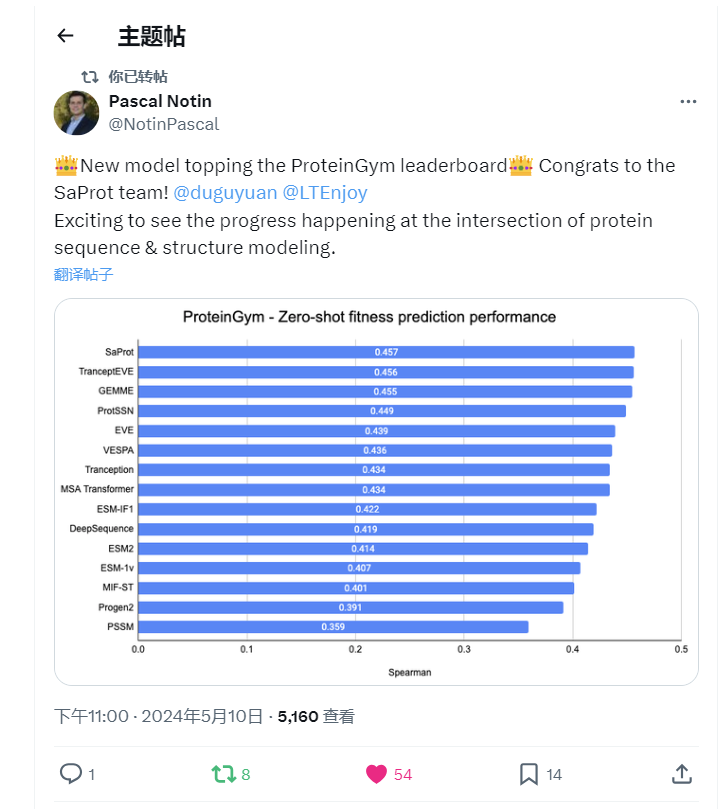

# SaProt: Protein Language Modeling with Structure-aware Vocabulary (AA+3Di)
<a href="https://www.biorxiv.org/content/10.1101/2023.10.01.560349v3"></a>
<a href="https://huggingface.co/westlake-repl/SaProt_650M_AF2"></a>
<a href="https://portal.valencelabs.com/blogs/post/saprot-protein-language-modeling-with-structure-aware-vocabulary-uyLPrUZqyDF60Yr" alt="blog"></a> 
<a href="https://zhuanlan.zhihu.com/p/664754366" alt="zhihu"></a> 

The repository is an official implementation of [SaProt: Protein Language Modeling with Structure-aware Vocabulary](https://www.biorxiv.org/content/10.1101/2023.10.01.560349v2).

If you have any question about the paper or the code, feel free to raise an issue! Saprot should outperform ESM-2 in most tasks under fair evaluation settings.

> The laboratory is hiring research assistants, interns, doctoral students, and postdoctoral researchers. Please contact the corresponding author for details.
>
>实验室招聘科研助理，实习生，博士生和博士后，请联系通讯作者

<details open><summary><b>Table of contents</b></summary>

- [News](#News)
- [Overview](#Overview)
- [Environment installation](#Environment-installation)
- [Prepare the SaProt model](#Prepare-the-SaProt-model)
  - [Model checkpoints](#Model-checkpoints)
  - [New experimental results](#New-experimental-results)
- [Load SaProt](#Load-SaProt)
  - [Hugging Face model](#Hugging-Face-model)
  - [Load SaProt using esm repository](#Load-SaProt-using-esm-repository)
- [Convert protein structure into structure-aware sequence](#Convert-protein-structure-into-structure-aware-sequence)
- [Predict mutational effect](#Predict-mutational-effect)
- [Get protein embeddings](#Get-protein-embeddings)
- [Perform protein inverse folding](#Perform-protein-inverse-folding)
- [Prepare dataset](#Prepare-dataset)
  - [Pre-training dataset](#Pre-training-dataset)
  - [Downstream tasks](#Downstream-tasks)
- [Fine-tune SaProt](#Fine-tune-SaProt)
- [Evaluate zero-shot performance](#Evaluate-zero-shot-performance)
- [Citation](#Citation)
</details>

## News
- **2024/12/09:** We released Saprot 1.3B version! Download it from [HuggingFace](https://huggingface.co/westlake-repl/SaProt_1.3B_AF2)
and see the experimental results [below](#SaProt-650M-vs-13B).
- **2024/08/14:** over 20 outstanding researchers in Biology&Bioinformatics have joined SaprotHub as co-authors. [Joining us and contribute](https://github.com/westlake-repl/SaprotHub).
- **2024/05/13:** We developed SaprotHub to make protein language model training accessible to all biologists. [Go](https://github.com/westlake-repl/SaprotHub).
- **2024/05/13:** SaProt ranked **#1st**  on the public ProteinGym benchmark in April2024, while other top-ranked models are  hybrid and mutation-specialized model.🎉🎉🎉! See [here](#proteingym-benchmark).
- **2024/04/18:** We found a slight difference for EC and GO evaluation and updated the re-evaluated results (see [issue #23](https://github.com/westlake-repl/SaProt/issues/23) for details).
- **2024/03/08:** We uploaded a simple function to make zero-shot prediction of mutational effect (see [example](#predict-mutational-effect)
below).
- **2024/01/17:** Our paper has been accepted as **ICLR 2024 spotlight** 🎉🎉🎉!
- **2023/10/30:** We release a pre-trained [SaProt 35M model](https://huggingface.co/westlake-repl/SaProt_35M_AF2) and a [35M residue-sequence-only version of SaProt](https://huggingface.co/westlake-repl/SaProt_35M_AF2_seqOnly) (for comparison)! The residue-sequence-only SaProt (without 3Di token) performs highly similar to the official ESM-2 35M model. (see Results below).
- **2023/10/30:** We released the results by using ESMFold structures. See Table below

## Overview
⚠️⚠️⚠️**Note: SaProt requires protein structure (SA token) input for optimal performance. For AA sequence-only use, finetuning is essential to match ESM2's (finetuning) performance. Frozen SaProt works for SA embeddings but not for AA embeddings.**


## Environment installation
### Create a virtual environment
```
conda create -n SaProt python=3.10
conda activate SaProt
```
### Install packages
```
bash environment.sh  
```

## Prepare the SaProt model
We provide two ways to use SaProt, including through huggingface class and  through the same way in [esm github](https://github.com/facebookresearch/esm). Users can choose either one to use. 

### Model checkpoints

| **Name**                                                     | **Size**        | Dataset                                                   |
| ------------------------------------------------------------ | --------------- | --------------------------------------------------------- |
| [SaProt_35M_AF2](https://huggingface.co/westlake-repl/SaProt_35M_AF2) | 35M parameters  | 40M AF2 structures                                        |
| [SaProt_650M_PDB](https://huggingface.co/westlake-repl/SaProt_650M_PDB) | 650M parameters | 40M AF2 structures (phase1) + 60K PDB structures (phase2) |
| [SaProt_650M_AF2](https://huggingface.co/westlake-repl/SaProt_650M_AF2) | 650M parameters | 40M AF2 structures                                        |

### New experimental results

Some experimental results are listed below. For more details, please refer to our paper.

#### 35M Model

|    **Model**     | **ClinVar** | **ProteinGym** | **Thermostability** | **HumanPPI** | **Metal Ion Binding** |  **EC**   | **GO-MF** | **GO-BP** | **GO-CC** | DeepLoc-**Subcellular** | **DeepLoc-Binary** |
| :--------------: | :---------: | :------------: | :-----------------: | :----------: | :-------------------: |:---------:|:---------:|:---------:|:---------:| :---------------------: | :----------------: |
|                  |     AUC     |  Spearman's ρ  |    Spearman's ρ     |     Acc%     |         Acc%          |   Fmax    |   Fmax    |   Fmax    |   Fmax    |          Acc%           |        Acc%        |
|   ESM-2 (35M)    |    0.722    |     0.339      |        0.669        |    80.79     |         73.08         |   0.825   |   0.616   |   0.416   |   0.404   |          76.58          |       91.60        |
| SaProt-Seq (35M) |    0.738    |     0.337      |        0.672        |    80.56     |         73.23         |   0.821   |   0.608   |   0.413   |   0.403   |          76.67          |       91.16        |
|   SaProt (35M)   |  **0.794**  |   **0.392**    |      **0.692**      |  **81.11**   |       **74.29**       | **0.847** | **0.642** | **0.431** | **0.418** |        **78.09**        |     **91.97**      |

#### 650M  Model

|   **Model**   | **ClinVar** | **ProteinGym** | **Thermostability** | **HumanPPI** | **Metal Ion Binding** |  **EC**   | **GO-MF** | **GO-BP** | **GO-CC** | DeepLoc-**Subcellular** | **DeepLoc-Binary** |
| :-----------: | :---------: | :------------: | :-----------------: | :----------: | :-------------------: |:---------:|:---------:|:---------:|:---------:| :---------------------: | :----------------: |
|               |     AUC     |  Spearman's ρ  |    Spearman's ρ     |     Acc%     |         Acc%          |   Fmax    |   Fmax    |   Fmax    |   Fmax    |          Acc%           |        Acc%        |
| ESM-2 (650M)  |    0.862    |     0.475      |        0.680        |    76.67     |         71.56         |   0.868   |   0.670   |   0.473   |   0.470   |          82.09          |       91.96        |
| SaProt (650M) |  **0.909**  |   **0.478**    |      **0.724**      |  **86.41**   |       **75.75**       | **0.882** | **0.682** | **0.486** | **0.479** |        **85.57**        |     **93.55**      |

#### AlphaFold2 vs. ESMFold

We compare structures predicted by AF2 or ESMFold, which is shown below:

|    **model**     | **ClinVar** | **ProteinGym** | **Thermostability** | **HumanPPI** | **Metal Ion Binding** |  **EC**   | **GO-MF** | **GO-BP** | **GO-CC** | DeepLoc-**Subcellular** | **DeepLoc-Binary** |
| :--------------: | :---------: | :------------: | :-----------------: | :----------: | :-------------------: |:---------:|:---------:|:---------:|:---------:| :---------------------: | :----------------: |
|                  |     AUC     |  Spearman's ρ  |    Spearman's ρ     |     Acc%     |         Acc%          |   Fmax    |   Fmax    |   Fmax    |   Fmax    |          Acc%           |        Acc%        |
| SaProt (ESMFold) |    0.896    |     0.455      |        0.717        |    85.78     |         74.10         |   0.871   |   0.678   |   0.480   |   0.474   |          82.82          |       93.19        |
|   SaProt (AF2)   |  **0.909**  |   **0.478**    |      **0.724**      |  **86.41**   |       **75.75**       | **0.882** | **0.682** | **0.486** | **0.479** |        **85.57**        |     **93.55**      |

#### SaProt 650M vs 1.3B
We trained a 1.3B parameter version of SaProt. Results showed on par performance between SaProt 1.3B and 650M, 
suggesting that increasing model size alone may not significantly improve performance. We welcome more evaluations 
by the community.

|   **model**   | **ClinVar** | **ProteinGym** | **Mega-scale** |
|:-------------:|:-----------:|:--------------:|:--------------:|
|               |     AUC     |  Spearman's ρ  |  Spearman's ρ  |
| SaProt (650M) |    0.909    |     0.457      |     0.574      |
| SaProt (1.3B) |  **0.910**  |   **0.460**    |   **0.588**    |


#### ProteinGym benchmark

SaProt achieved first position on ProteinGym benchmark! The [checkpoint](https://huggingface.co/westlake-repl/SaProt_650M_AF2) was trained on Sep. 2023.




## Load SaProt

### Hugging Face model

The following code shows how to load the model based on huggingface class. Note masking lower pLDDT regions for AF2 structures is beneficial ,see below.

```python
from transformers import EsmTokenizer, EsmForMaskedLM

model_path = "/your/path/to/SaProt_650M_AF2" # Note this is the directory path of SaProt, not the ".pt" file
tokenizer = EsmTokenizer.from_pretrained(model_path)
model = EsmForMaskedLM.from_pretrained(model_path)

#################### Example ####################
device = "cuda"
model.to(device)

seq = "M#EvVpQpL#VyQdYaKv" # Here "#" represents lower plDDT regions (plddt < 70)
tokens = tokenizer.tokenize(seq)
print(tokens)

inputs = tokenizer(seq, return_tensors="pt")
inputs = {k: v.to(device) for k, v in inputs.items()}

outputs = model(**inputs)
print(outputs.logits.shape)

"""
['M#', 'Ev', 'Vp', 'Qp', 'L#', 'Vy', 'Qd', 'Ya', 'Kv']
torch.Size([1, 11, 446])
"""
```

### Load SaProt using esm repository
User could also load SaProt by [esm](https://github.com/facebookresearch/esm) implementation. The checkpoint is
stored in the same huggingface folder, named `SaProt_650M_AF2.pt`. We provide a function to load the model.
```python
from utils.esm_loader import load_esm_saprot

model_path = "/your/path/to/SaProt_650M_AF2.pt"
model, alphabet = load_esm_saprot(model_path)
```

## Convert protein structure into structure-aware sequence
We provide a function to convert a protein structure into a structure-aware sequence. The function calls the 
[foldseek](https://github.com/steineggerlab/foldseek) 
binary file to encode the structure. You can download the binary file from [here](https://drive.google.com/file/d/1B_9t3n_nlj8Y3Kpc_mMjtMdY0OPYa7Re/view?usp=sharing) and place it in the `bin` folder
. The following code shows how to use it.
```python
from utils.foldseek_util import get_struc_seq
pdb_path = "example/8ac8.cif"

# Extract the "A" chain from the pdb file and encode it into a struc_seq
# pLDDT is used to mask low-confidence regions if "plddt_mask" is True. Please set it to True when
# use AF2 structures for best performance.
parsed_seqs = get_struc_seq("bin/foldseek", pdb_path, ["A"], plddt_mask=False)["A"]
seq, foldseek_seq, combined_seq = parsed_seqs

print(f"seq: {seq}")
print(f"foldseek_seq: {foldseek_seq}")
print(f"combined_seq: {combined_seq}")
```

## Predict mutational effect
We provide a function to predict the mutational effect of a protein sequence. The example below shows how to predict
the mutational effect at a specific position. If using the AF2 structure, we strongly recommend that you add pLDDT mask (see below). 
```python
from model.saprot.saprot_foldseek_mutation_model import SaprotFoldseekMutationModel


config = {
    "foldseek_path": None,
    "config_path": "/your/path/to/SaProt_650M_AF2", # Note this is the directory path of SaProt, not the ".pt" file
    "load_pretrained": True,
}
model = SaprotFoldseekMutationModel(**config)
tokenizer = model.tokenizer

device = "cuda"
model.eval()
model.to(device)

seq = "M#EvVpQpL#VyQdYaKv" # Here "#" represents lower plDDT regions (plddt < 70)

# Predict the effect of mutating the 3rd amino acid to A
mut_info = "V3A"
mut_value = model.predict_mut(seq, mut_info)
print(mut_value)

# Predict mutational effect of combinatorial mutations, e.g. mutating the 3rd amino acid to A and the 4th amino acid to M
mut_info = "V3A:Q4M"
mut_value = model.predict_mut(seq, mut_info)
print(mut_value)

# Predict all effects of mutations at 3rd position
mut_pos = 3
mut_dict = model.predict_pos_mut(seq, mut_pos)
print(mut_dict)

# Predict probabilities of all amino acids at 3rd position
mut_pos = 3
mut_dict = model.predict_pos_prob(seq, mut_pos)
print(mut_dict)
```

## Get protein embeddings
If you want to generate protein embeddings, you could refer to the following code. The embeddings are the average of
the hidden states of the last layer.
```python
from model.saprot.base import SaprotBaseModel
from transformers import EsmTokenizer


config = {
    "task": "base",
    "config_path": "/your/path/to/SaProt_650M_AF2", # Note this is the directory path of SaProt, not the ".pt" file
    "load_pretrained": True,
}

model = SaprotBaseModel(**config)
tokenizer = EsmTokenizer.from_pretrained(config["config_path"])

device = "cuda"
model.to(device)

seq = "M#EvVpQpL#VyQdYaKv" # Here "#" represents lower plDDT regions (plddt < 70)
tokens = tokenizer.tokenize(seq)
print(tokens)

inputs = tokenizer(seq, return_tensors="pt")
inputs = {k: v.to(device) for k, v in inputs.items()}

embeddings = model.get_hidden_states(inputs, reduction="mean")
print(embeddings[0].shape)
```

## Perform protein inverse folding
We provide a function to perform protein inverse folding. Please see the example below.
```python
from model.saprot.saprot_if_model import SaProtIFModel

# Load model
config = {
    # Please download the weights from https://huggingface.co/westlake-repl/SaProt_650M_AF2_inverse_folding
    "config_path": "/your/path/to/SaProt_650M_AF2_inverse_folding",
    "load_pretrained": True,
}

device = "cuda"
model = SaProtIFModel(**config)
model = model.to(device)

aa_seq = "##########" # All masked amino acids will be predicted. You could also partially mask the amino acids.
struc_seq = "dddddddddd"

# Predict amino acids given the structure sequence
pred_aa_seq = model.predict(aa_seq, struc_seq)
print(pred_aa_seq)
```

## Prepare dataset
### Pre-training dataset
We provide the dataset for pre-training SaProt. The dataset can be downloaded from
[here](https://huggingface.co/datasets/westlake-repl/AF2_UniRef50).

### Downstream tasks
We provide datasets that are used in the paper. Datasets can be downloaded from 
[here](https://drive.google.com/drive/folders/11dNGqPYfLE3M-Mbh4U7IQpuHxJpuRr4g?usp=sharing).

Once downloaded, the datasets need to be decompressed and placed in the `LMDB` folder for supervised fine-tuning.

## Fine-tune SaProt
We provide a script to fine-tune SaProt on the datasets. The following code shows how to fine-tune SaProt on specific
downstream tasks. Before running the code, please make sure that the datasets are placed in the `LMDB` folder and the
huggingface version of SaProt 650M model is placed in the `weights/PLMs` folder. **Note that the default training setting is not as 
same as in the paper because of the hardware limitation for different users. We recommend users to modify the yaml file 
flexibly based on their own conditions (i.e. batch_size, devices and accumulate_grad_batches).**

```
# Fine-tune SaProt on the Thermostability task
python scripts/training.py -c config/Thermostability/saprot.yaml

# Fine-tune ESM-2 on the Thermostability task
python scripts/training.py -c config/Thermostability/esm2.yaml
```
### Record the training process (optional)
If you want to record the training process using wandb, you could modify the config file and set `Trainer.logger = True`
and then paste your wandb API key in the config key `setting.os_environ.WANDB_API_KEY`.

## Evaluate zero-shot performance
We provide a script to evaluate the zero-shot performance of models (foldseek binary file is required to be placed in
the `bin` folder):
```
# Evaluate the zero-shot performance of SaProt on the ProteinGym benchmark
python scripts/mutation_zeroshot.py -c config/ProteinGym/saprot.yaml

# Evaluate the zero-shot performance of ESM-2 on the ProteinGym benchmark
python scripts/mutation_zeroshot.py -c config/ProteinGym/esm2.yaml
```
The results will be saved in the `output/ProteinGym` folder.

For **ClinVar** benchmark, you can use the following script to calculate the AUC metric:
```
# Evaluate the zero-shot performance of SaProt on the ClinVar benchmark
python scripts/mutation_zeroshot.py -c config/ClinVar/saprot.yaml
python scripts/compute_clinvar_auc.py -c config/ClinVar/saprot.yaml
```

## Citation
If you find this repository useful, please cite our paper:
```
@article{su2023saprot,
  title={SaProt: Protein Language Modeling with Structure-aware Vocabulary},
  author={Su, Jin and Han, Chenchen and Zhou, Yuyang and Shan, Junjie and Zhou, Xibin and Yuan, Fajie},
  journal={bioRxiv},
  year={2023},
  publisher={Cold Spring Harbor Laboratory}
```
